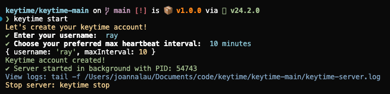
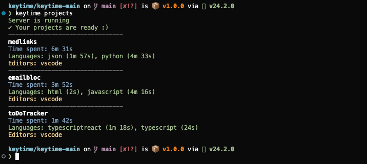
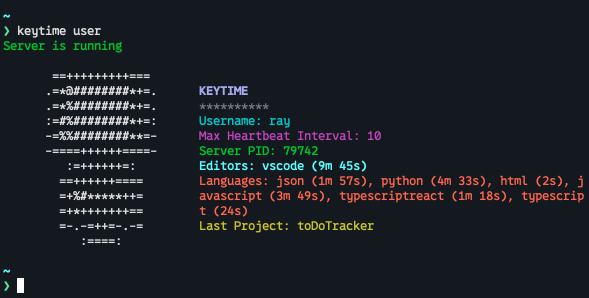
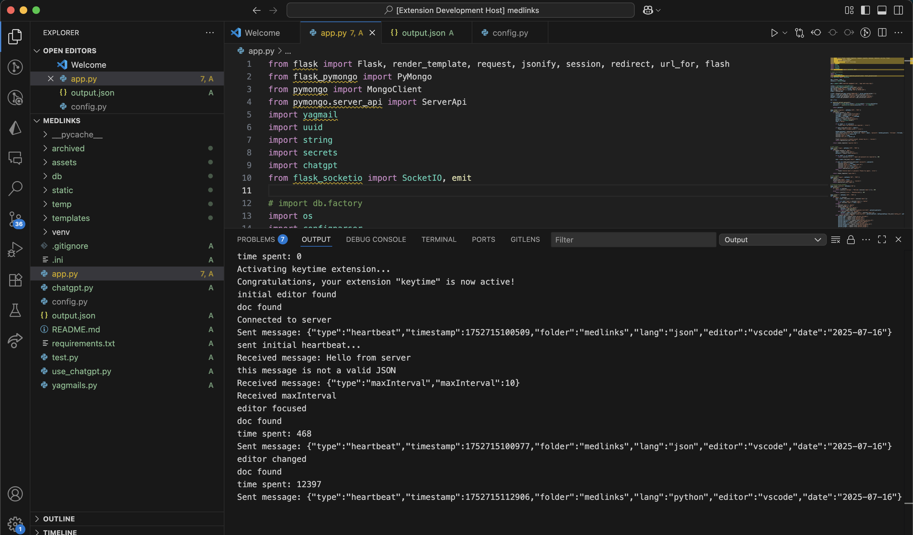

# Keytime

Keytime is a coding time tracker that helps you monitor and analyze your programming activity.

It consists of two main components:

- **keytime-main**: The command line interface (CLI) and server, built with Node.js. This tool manages your account, tracks your coding time, and stores data locally using a Prisma SQLite database. It provides commands to view project stats, view user profile and control the background server.
- **keytime-ext**: A VSCode extension that monitors your coding activity and sends heartbeats (activity pings) to the keytime server for accurate time tracking. More extensions for various coding platforms can also be added!

Setup instructions for the keytime CLI can be viewed in its [README](keytime-main/README.md). The VSCode extenion can be installed from the [VSCode marketplace](https://marketplace.visualstudio.com/items?itemName=sunray4.keytime-ext).

##### Watch project demo here: https://hc-cdn.hel1.your-objectstorage.com/s/v3/b00b670370756475a6b5726c401aad38520e9227_keytime_demo.mp4

---

### User account setup

### Displays all projects and respective coding time

### Displays user information

### Extension communicating with server

